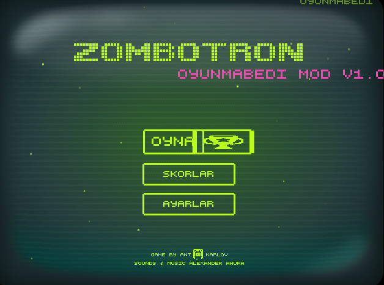
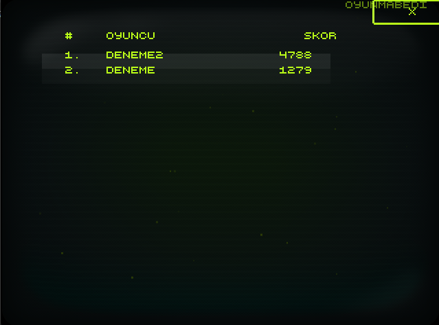
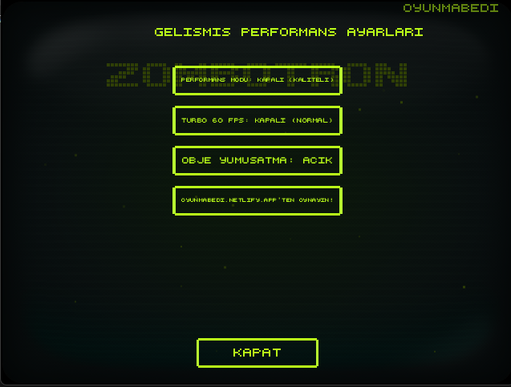
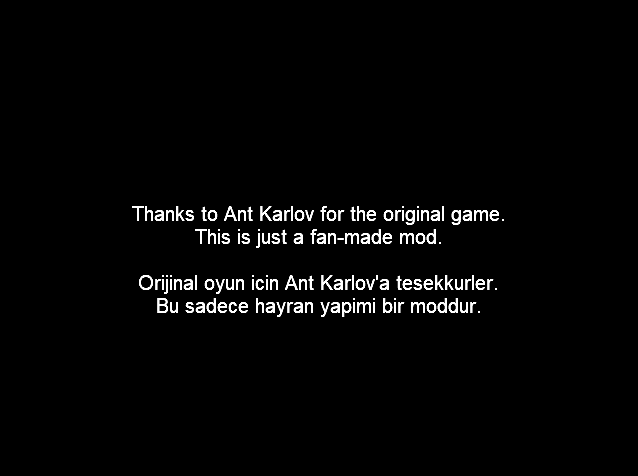

  

# Zombotron 1 - OyunMabedi Mod 🧟‍♂️🎮

[English Version Below](#english-version)

Eski zamanların o hantal, bekleme ekranlarıyla dolu Zombotron'unu alıp, tamamen kurşun geçirmez ve yıldırım hızında bir yapıya büründürdük. Yükleme barlarını ve o bitmek bilmeyen logoları boşver; karanlığa daha hızlı dalman için her şeyi değiştirdik.

Bu proje tamamen hayran yapımı (fan-made) bir modifikasyondur. Kâr amacı gütmez. 

---

## 🌟 Yenilikler ve Özellikler

- **Turbo 60 FPS Modu:** Silahlar, zombiler ve patlamalar artık olması gerektiği gibi kusursuz bir pürüzsüzlükte. (Not: Oyunun hızını da artırır, gerçek bir zorluk arayanlara özel!)
- **Zamanı Bükme (Splash Screen Atla):** Karşına çıkan o meşhur başlangıç logolarını tek bir tıkla (veya kısayolla) geçip aksiyona anında dalabilirsin.
- **Skor Tablosu:** Özel olarak entegre edilmiş ağ bağlantısı sayesinde skorlarını kaydedebilir ve diğer oyuncularla yarışabilirsin!
   
  
- **Yeni Ayarlar Sekmesi:** Oyun içi deneyimini kişiselleştirmen için yepyeni bir ayarlar menüsü.
   
  
- **Bağımsız (Standalone) Çalışma:** Tarayıcılara veya eski Flash Player eklentilerine mahkum değilsin. İndirdiğin `.exe` dosyasını çalıştırıp doğrudan oynamaya başla.

## 📥 Kurulum & Oynanış
Sadece sağ taraftaki **Releases (Sürümler)** bölümünden `OyunMabedi Zombotron 1.exe` dosyasını indirerek hemen oynamaya başlayabilirsiniz. Eğer sadece SWF dosyasını kullanmak isterseniz `Zombotron_OyunMabedi.swf` dosyasını herhangi bir Flash oynatıcı ile açabilirsiniz.

## 🙏 Teşekkürler (Special Thanks to Ant Karlov)
Bu muhteşem oyunun asıl yaratıcısı ve çocukluğumuzun kahramanı olan **Ant Karlov**'a sonsuz teşekkürler. Zombotron serisi bir efsanedir ve bu mod tamamen bu efsaneye duyulan sevgiyle ortaya çıkmıştır.
Bütün haklar orijinal yapımcıya aittir. All original rights belong to Ant Karlov.

  

---

# Zombotron 1 - OyunMabedi Mod 🧟‍♂️🎮

We took the clunky, loading-screen-filled Zombotron of the old days and transformed it into a bulletproof, lightning-fast experience. Forget the loading bars and endless logos; we've changed everything so you can dive into the darkness faster.

This project is entirely a fan-made modification and is non-profit.

## 🌟 Features & Enhancements

- **Turbo 60 FPS Mode:** Weapons, zombies, and explosions are now flawlessly smooth, just as they should be. (Note: It also speeds up the game, perfect for those seeking a real challenge!)
- **Time Bending (Skip Splash Screens):** Skip those famous starting logos with a single click (or shortcut) and jump straight into the action.
- **Scoreboard Integration:** Thanks to a custom network integration, you can now save your scores and compete with other players!
   
  
- **New Settings Tab:** A brand new settings menu to personalize your in-game experience.
   
  
- **Standalone Execution:** No need for browsers or outdated Flash Player plugins. Just download and run the `.exe` file and start surviving.

## 📥 Installation & How to Play
Simply download the `OyunMabedi Zombotron 1.exe` file from the **Releases** section on the right to start playing immediately. If you prefer using just the SWF file, you can open `Zombotron_OyunMabedi.swf` with any Flash Player.

## 🙏 Special Thanks to Ant Karlov
Endless thanks to **Ant Karlov**, the original creator of this amazing game and a hero of our childhood. The Zombotron series is a legend, and this mod was born purely out of love for this legend.
All original rights belong to Ant Karlov.

  

